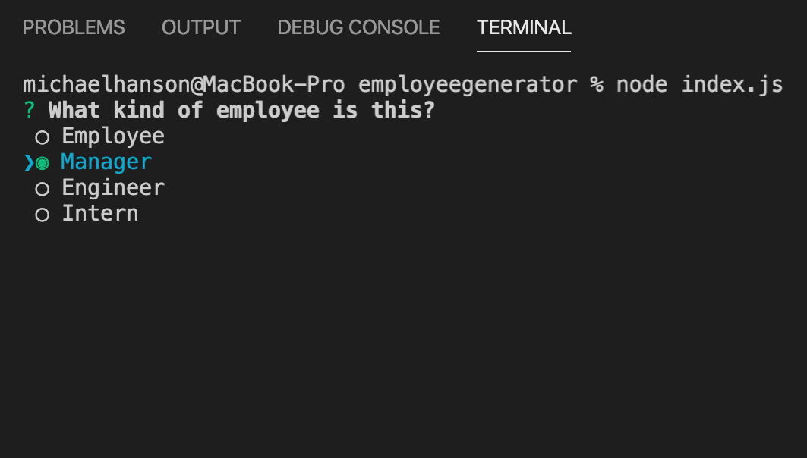
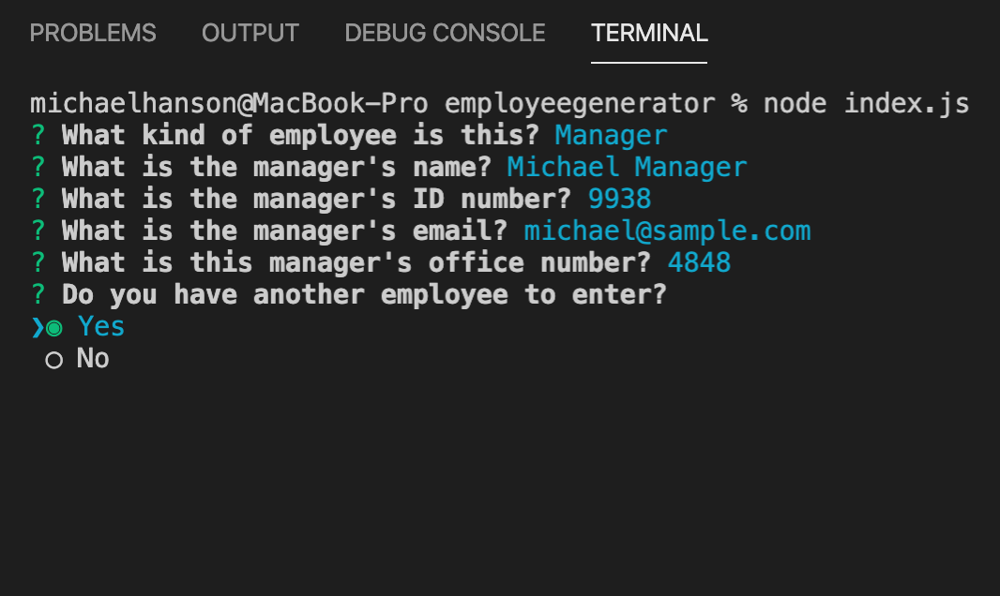

# Employee Generator

## Description 

This CLI Node.js application allows a user to generate an HTML page that displays information about the employees on a company team based on Inquirer prompts in the terminal. 

When this program is run using Node.js (node index.js) in the terminal, the user will be prompted to enter information about company employees. Depending on the employee type selected, the user will be asked to enter information specific to that employee type (manager, engineer, intern, or default employee). Once the user has no more employees to enter, the user will be asked to indicate the company or team name. Once this information is input, the console will output the entered information for reference as well as a message informing that the finished team.html page was generated in the folder called output. The user can now open the generated HTML page in the browser and view the team with active links where applicable. 

The program uses Test Driven Development (Jest) to ensure that the constructors, properties, and methods of each employee object instance work as anticipated. The program also validates user input that must be a number or email. The user will be prompted to change input that is invalid.

## Demonstration

[CLICK HERE](https://drive.google.com/file/d/17HwHl0EUbFB6HlJBijzEygd8TMX6s9sT/view?usp=sharing) for a video that demonstrates the use of this project! 

## Features

* Runs in the command line using Node.js.
* Written in Javascript. 
* Runs tests using Jest to validate object properties and methods. 
* Includes Inquirer to receive and validate user input via command line. 
* Incorporates Bootstrap for responsiveness. 
* Uses fs to read and write HTML files. 

## Credits

Michael Hanson
* michaeledwardhanson@gmail.com
* [GitHub](https://github.com/mhans003)
* [LinkedIn](https://www.linkedin.com/in/michaeledwardhanson/)

## License 

Licensed under the [MIT License](./LICENSE.txt).
